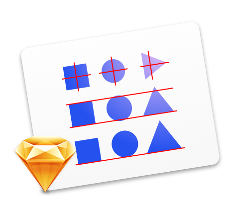
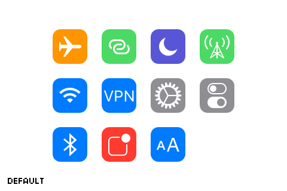

# Optically for Sketch
A handy plugin for automated and mathematically precise optical adjustments in Sketch.

Optically makes it easy to align layers to visual centers, align edges with overshooting and scale layers to the same size.

 

*This is a commercial plugin. Please visit [http://designplugins.com/optically](http://designplugins.com/optically) for more details.*